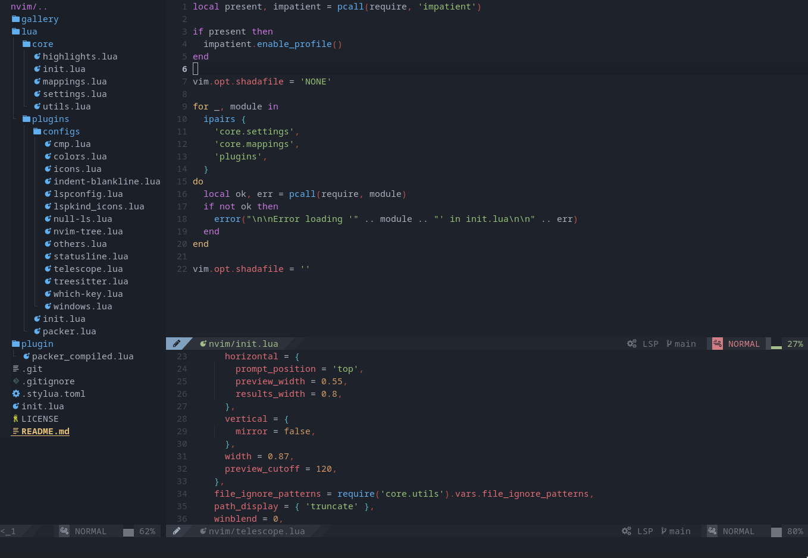
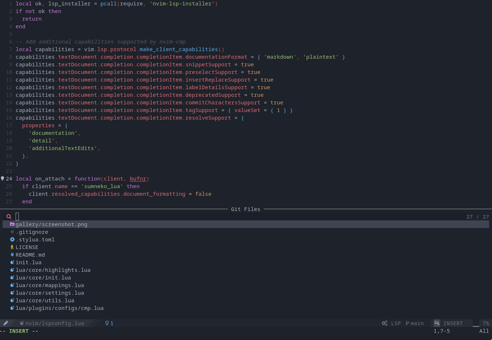
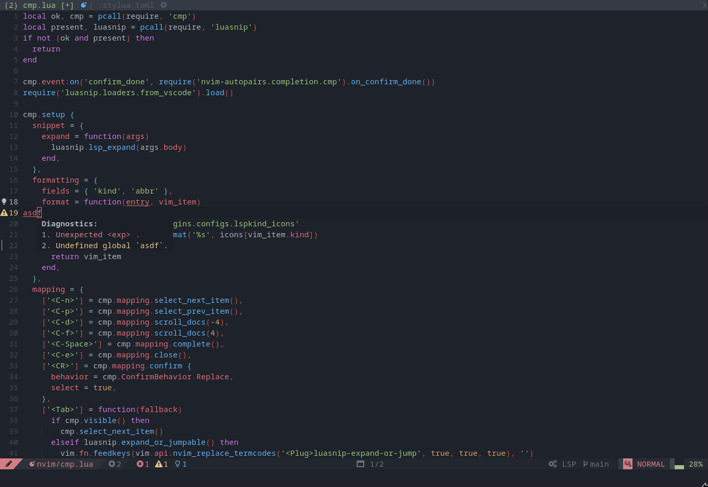
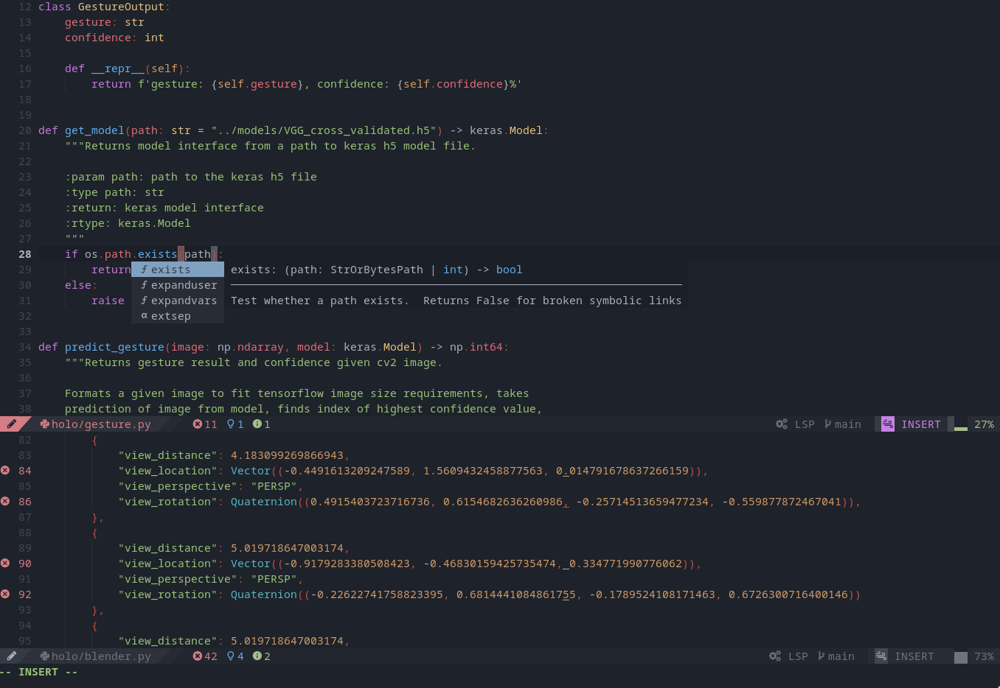
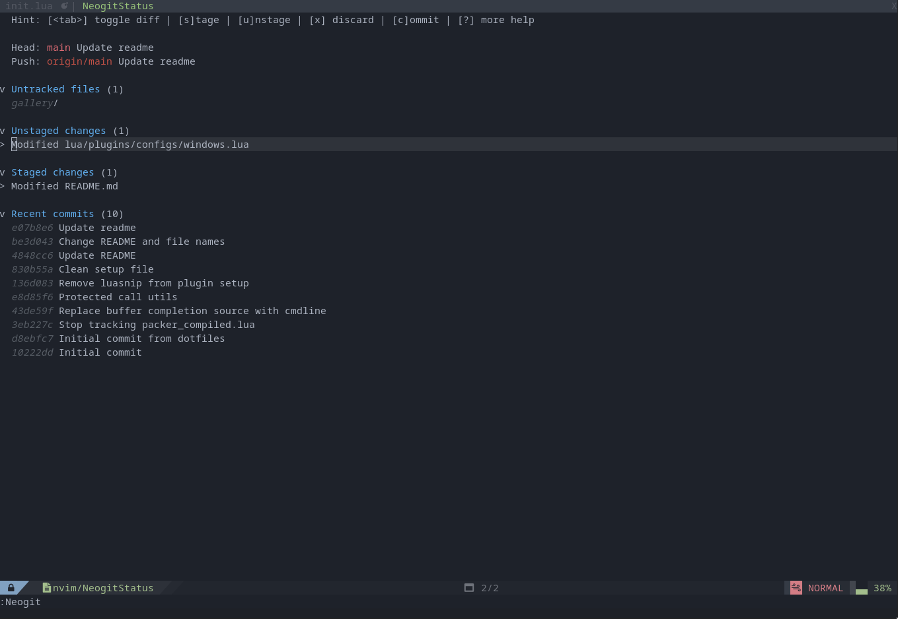
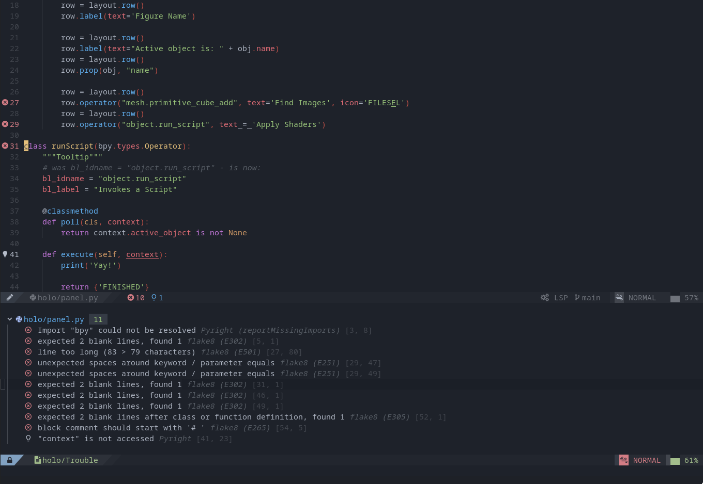
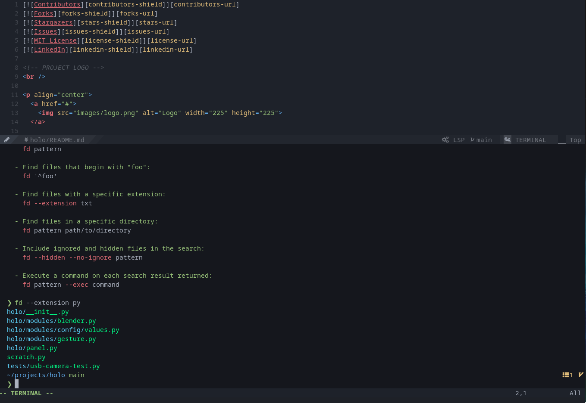

<br />
<p align="center">
  <h1 align="center">nvdev</h1>
  <p align="center">
    An incredibly optimized and fully featured neovim development environment ~ 0.05s startup
    <br />
    <br />
    <a href="https://github.com/chinarjoshi/nvdev/issues">Report Bug</a>
    ·
    <a href="https://github.com/chinarjoshi/nvdev/issues">Request Feature</a>
  </p>
</p>

## Quick Pitch

 1. **Leader Mappings**
  - Cleverly thought out and discoverable hotkeys for common functions (e.g. \<SPC>\<SPC> to search project files) and two letters for less common functions (e.g. \<SPC\>tn to make new tab)
  - Phonetic behavior always using first letter of function as the mapping ("search TODO-list" becomes \<SPC\>st)
  - Covers all common usage for both vim features and plugin features

 2. **Completeness**: Contains *all* the functionality you need from an IDE with 43 plugins that are fully configured and performant

 3. **Minimal Abstraction**: Uses an idiomatic and straightforward configuration structure to make further configuration easy to add

 4. **Speed**: Fully written in lua, and the number of plugins hardly matters since (almost) all plugins are lazy loaded on commands/events/load order

## Benchmarking

```bash
❯ time nvim mappings.lua +q
nvim mappings.lua +q  0.05s user 0.03s system 102% cpu 0.074 total
```

```bash
❯ nvim mappings.lua --startuptime vim.log
❯ tail -n3 vim.log
063.360  000.583: before starting main loop
067.368  004.008: first screen update
067.370  000.002: --- NVIM STARTED ---
```

## Installation

Clone nvdev into your neovim configuration folder, and then call PackerSync to install all plugins

```bash
git clone https://github.com/chinarjoshi/nvdev ~/.config/nvim --depth 1
nvim +'hi NormalFloat guibg=#1e222a' +PackerSync
```

## Configuration Structure
`~/.config/nvim`
```
├── lua
│   ├── core
│   │   ├── init.lua
│   │   ├── mappings.lua
│   │   ├── settings.lua
│   │   ├── utils.lua
│   └── plugins
│       ├── configs
│       │   ├── cmp.lua
│       │   ├── icons.lua
│       │   ├── indent-blankline.lua
│       │   ├── lspconfig.lua
│       │   ├── lspkind-icons.lua
│       │   ├── null-ls.lua
│       │   ├── nvim-tree.lua
│       │   ├── others.lua
│       │   ├── statusline.lua
│       │   ├── telescope.lua
│       │   ├── treesitter.lua
│       │   └── windows.lua
│       ├── init.lua
│       └── packer.lua
└── init.lua

4 directories, 19 files
```

### Files
`/nvim`
 * [init.lua](init.lua): Loads settings, mappings, and sets up plugins
 * [lua](lua): Folder containing lua modules

`/nvim/lua/core`
 * [init.lua](lua/init.lua): Initial setup file that calls all plugins for lazy loading purposes
 * [mappings.lua](lua/mappings.lua): Defines keybindings through which-key
 * [settings.lua](lua/settings.lua): Sets editor options, defines autocommands, and disables builtin plugins
 * [utils.lua](lua/utils.lua): A few utility functions and quick variables to change

`/nvim/lua/plugins`
 * [init.lua](lua/init.lua): (**IMPORTANT**) List of managed plugins and lazy loaders
 * [packer.lua](lua/packer.lua): Packer.nvim initialization and requires all config files
 * [configs](lua/configs): Folder containing plugin-specific config

`/nvim/lua/configs`
 * [cmp.lua](lua/configs/cmp.lua): Autocompletion
 * [icons.lua](lua/configs/icons.lua): Custom devicons
 * [indent-blankline.lua](lua/configs/indent-blankline.lua): Indent line
 * [lspconfig.lua](lua/configs/lspconfig.lua): LSP and installer configuration
 * [null-ls.lua](lua/configs/null-ls.lua): Adapter for command line formatters/linters
 * [nvim-tree](lua/configs/nvim-tree.lua): File tree
 * [others.lua](lua/configs/others.lua): All other plugin setup
 * [statusline.lua](lua/configs/feline.lua): Statusline
 * [telescope.lua](lua/configs/telescope.lua): Fuzzy finder
 * [treesitter.lua](lua/configs/treesitter.lua): Treesitter interface
 * [windows.lua](lua/configs/windows.lua): Window and split based plugins

## Plugin List

### Base
 * packer.nvim
 * nvim-treesitter
 * nvim-tree
 * telescope.nvim
 * nvim-cmp (+ Sources)
 * LuaSnip
 * project.nvim
 * which-key.nvim
 * impatient.nvim
 * plenary.nvim
 * filetype.nvim

### LSP
 * nvim-lspconfig
 * null-ls.nvim
 * lsp\_signature.nvim
 * nvim-lsp-installer
 * trouble.nvim
 * lspkind-nvim

### Editing
 * lightspeed.nvim
 * vim-surround
 * vim-commentary
 * vim-repeat
 * todo-comments.nvim

### Windows and splits
 * nvim-window
 * focus.nvim
 * winshift.nvim

### Aesthetic
 * material.nvim
 * feline.nvim
 * nvim-web-devicons
 * nvim-colorizer

### Etc.
 * neogit
 * neorg
 * gitsigns.nvim
 * nvim-autopairs
 * toggleterm.nvim
 * indent-blankline.nvim


## Gallery
<p align="center">General editing:</p>
<p align="center">
  
</p>

<p align="center">Fuzzy finder:</p>
<p align="center">
  
</p>

<p align="center">LSP diagnostics and multiple tabs:</p>
<p align="center">
  
</p>

<p align="center">Autocompletion in python:</p>
<p align="center">
  
</p>

<p align="center">Git client:</p>
<p align="center">
  
</p>

<p align="center">Trouble diagnostics:</p>
<p align="center">
  
</p>

<p align="center">Terminal with syntax highlighting:</p>
<p align="center">
  
</p>

## Inspirations
 * [NvChad](https://github.com/NvChad/NvChad) for the inspiration and organizational structure
 * [neovim-lua](https://github.com/brainfucksec/neovim-lua) for autocommands and understanding lua

## TODO
 * Fix window auto-focusing behavior ([windows.lua](lua/plugins/configs/windows.lua))
 * Fix certain snippets not showing in python files
